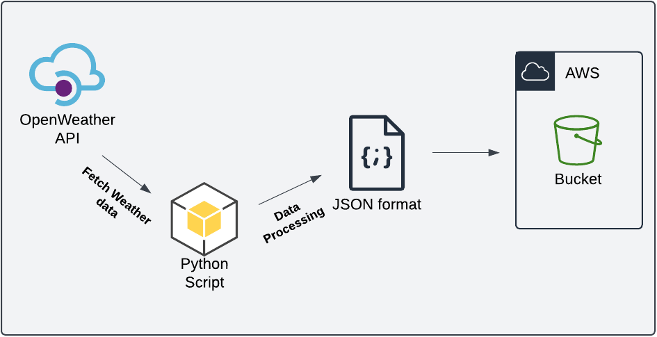

# Weather Data Collection System - DevOps Day 1 Challenge

This application pulls data from the open weather API, processes it to a JSON, then store it in an S3 bucket.

## Project Diagram

## Project Files

+ data - local storage for development testing
+ src - main folder holding python code
  + src/\__init__\.py - makes the parent folder a python package so you can import python libraries
  + src/weather_dasboard.py - python script file for this project
+ tests - unit test folder

## Project Setup

+ Go to [openweathermap.org/api](https://openweathermap.org/api) and sign up
+ Get access keys for api requests
+ Get your AWS access and secret key
+ Configure your AWS keys using: `aws configure`
+ Confirm pip is installed by by running: `pip --version`
+ Install requirements.txt file by running this command:
`pip install -r requirements.txt`

## Starting the project
